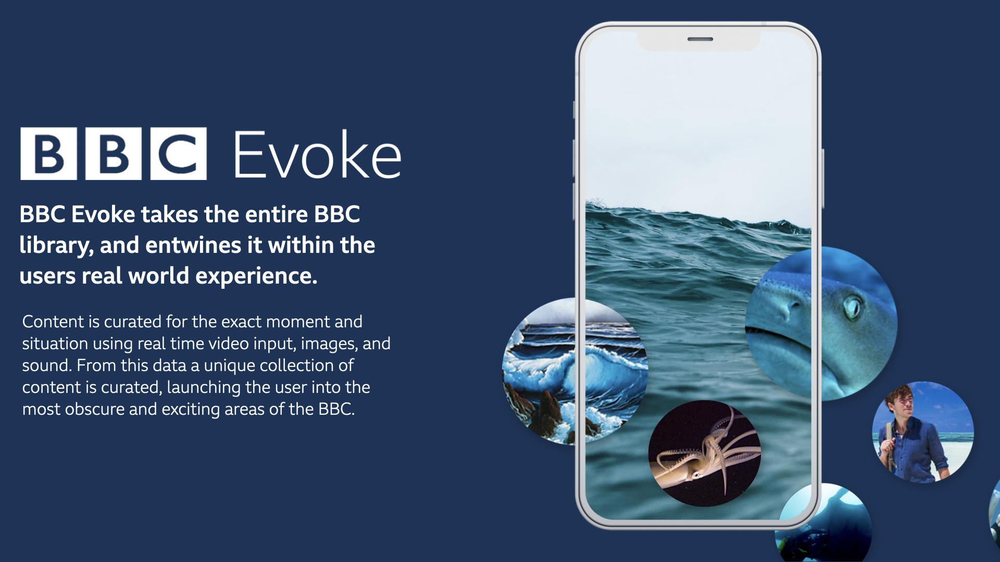
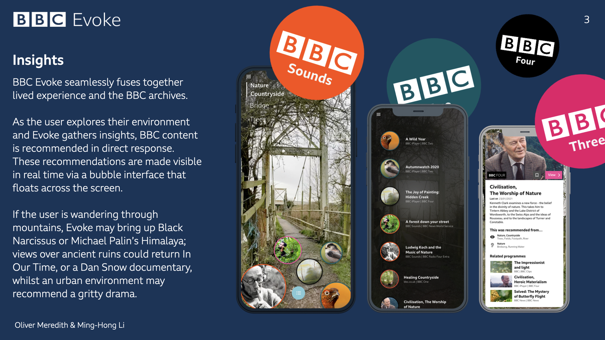
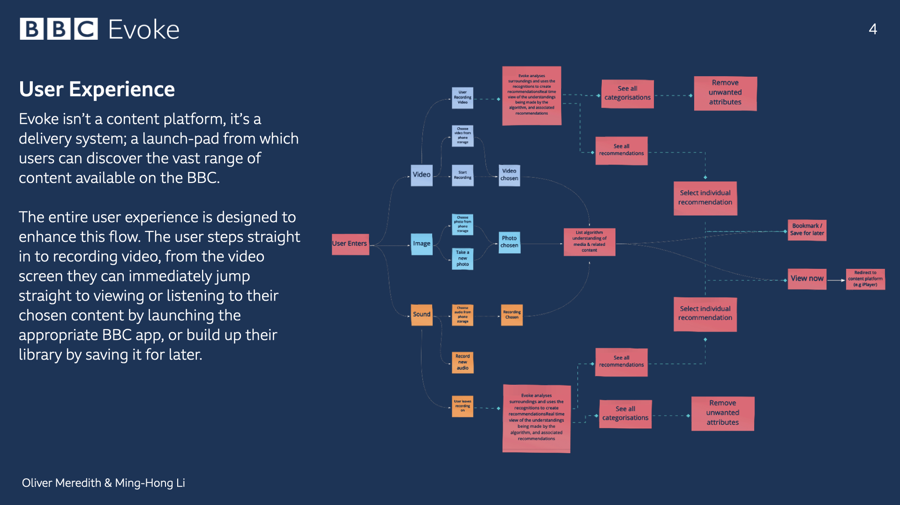
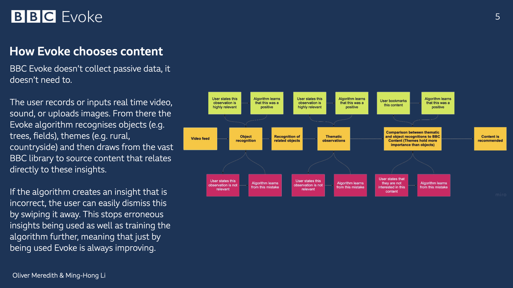

# Brief
This brief asked us to create a “new customer experience to help the BBC’s audience fit the BBC into their daily lives, tailored and optimised to where they are and the device they are using”. This meant thinking deeply about scenarios in which users access BBC services, how they do so, and how can we expand that experience in a unique, exciting way.
# Solution
Our solution category-winning solution, BBC Evoke, takes the users immediate experience —via real-time video and sound— and uses it to curate unique collections of content that are perfectly suited to their current environment. Our concept uses object recognition technology to recognise the users' environment and select BBC content that relates specifically to those observations. This experience is transparent; the user is always given feedback on how their content is being curated, avoiding the need for intrusive data collection.

`video: https://www.youtube.com/watch?v=KlJpwUF4RzI&t=11s`

