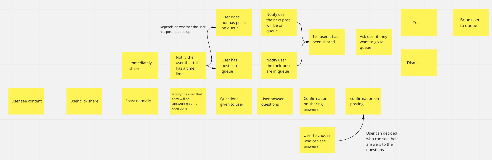
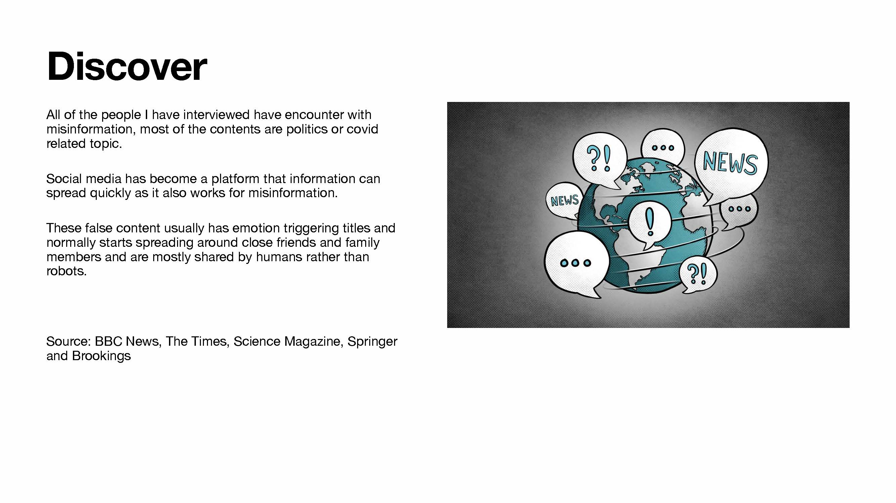
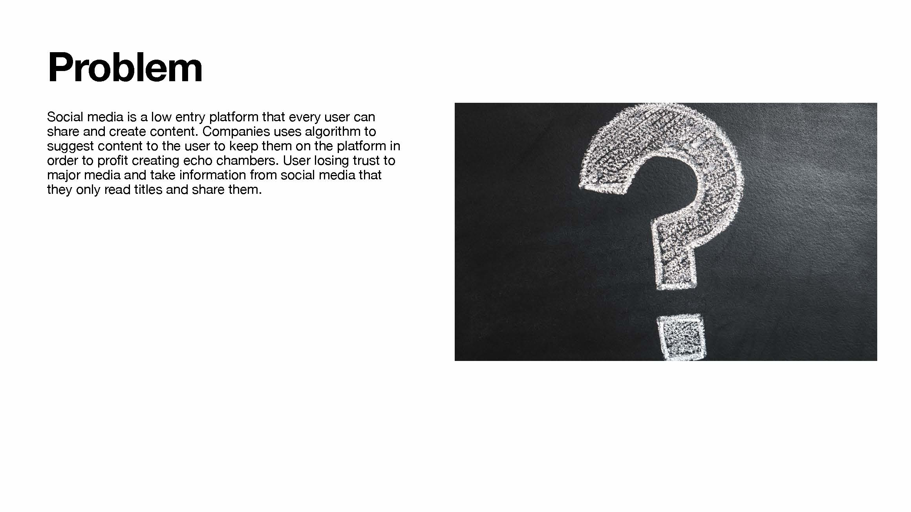

Lapse is a service I have researched and designed to treat the misinformation problem on social media. 

"If you get people to stop and think, they do a better job at evaluating what they're reading" - the Times

Lapse requires the user to pause and think before sharing and posting contents, it is an alternative way to improve content environment on social media without censorship. 

It is designed to give the user a little inconvenience to create a better content environment on social media platforms. 

